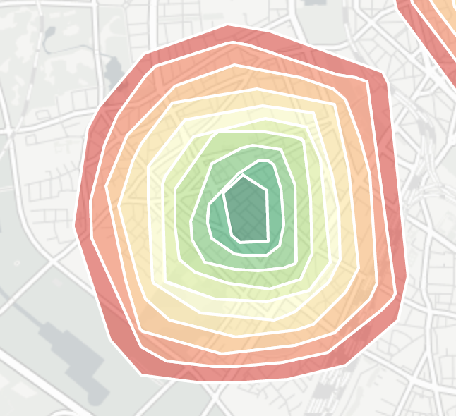

# isochrone

Das Projekt isochrone erlaubt es, isochrone in einer Datenbank zu speichern. Es können keine Isochronen erzeugt werden. Es wird vorausgesetzt, dass die einzulesenden Isochronen im geojson Format vorliegen. Zum Einlesen der Isochronen werden die export-Ergebnisse von [openrouteserivce](https://www.openrouteservice.org/reach) verwendet. Der Service soll verschiedene Clients unterstützen. Die Trennung schnittstellen-seitig erfolgt durch einen entsprechenden Pfad.

# Status

Die Applikation befindet sich in der Entwicklung

# Verwendete Technologien

- Java
- Postgres/ Postgis

# REST Endpoints

## /isochrone/service/ping

Diese Schnittstelle wird verwendet um zu prüfen, ob der Service selbst erreichbar ist.

## /isochrone/service/{client}

Diese Schnittstelle liefert alle für den Client gespeicherten isochronen aus. Mit dem Übergabeparameter 'format=geojson' werden die Ergebnisse als geojson zurückgeliefert. Es werden jeweils nur die Bereiche zurückgeliefert, die nicht bereits durch ein kleineres Polygon belegt sind.

## /isochrone/service/clients

Diese Schnittstelle liefert Informationen zu allen auf dem System vorhandenen Clients.

## /isochrone/service/load/{client}

Die Daten werden über die Schnittstelle '/isochrone/service/load/{client}' eingelesen. Diese kann nur von localhost aus aufgerufen werden. Die einzulesenden Daten müssen im Verzeichnis '/var/cache/isochrone' in Form einer Geojson Daten vorliegen. Die Datei muss den Namen des clients haben (z.B. test.geojson). Liegt keine passsende Datei vor, können keine Daten eingelesen werden. Der Load-Mechanismus sieht vor, dass alle von [openrouteserivce](https://www.openrouteservice.org/reach) benutzten Felder vorhanden sind werden.

# User Interface

Um die in der Datenbank vorhandenen Isochrone prüfen zu können, steht eine einfache Benutzeroberfläche auf Basis von leaflet zur Verfügung. Zur Verwendung muss in '/isochrone/src/main/webapp/assets/js/app.js' die url zum darzustellenden Isochron angepasst werden. Die Oberfläche ist über 'http://{server}:{port}/isochrone' erreichbar.

# Datenbank

## DB User auf Postgres einrichten

    sudo -u postgres createuser -P isochrone
    
## Datenbank baumkataster anlegen

    sudo -u postgres createdb -O isochrone isochrone

## Postgis topology

    sudo -u postgres psql -c "CREATE EXTENSION postgis; CREATE EXTENSION postgis_topology;" isochrone
    
## Tabelle

### isochrone

| Spalte | Typ | Beschreibung |
| ------ | --- | ------------ |
| number | serial | eindeutige nummer über alle gespeicherten Datensätze |
| id | integer | id eines rings eines isochron |
| client | varchar(128) |  |
| value | integer |  |
| area | double precision | Fläche des Polygons |
| reachfactor | double precision |  |
| center | POINT | Spalte für den Mittelpunkt des Polygons |
| geom | MULTIPOLYGON | Spalte für das Polygon |
| donut | MULTIPOLYGON | nur der Teil, der nicht von den anderen Polygonen besetzt wird |
| modtime | timestamp | Zeitpunkt zu dem der Datensatz eingefügt wurde |

    CREATE TABLE ISOCHRONE (
      number      SERIAL PRIMARY KEY, 
      id          integer,
      client      varchar(128),
      value       integer, 
      area        double precision,
      reachfactor double precision,
      modtime       timestamp DEFAULT current_timestamp
    );
    SELECT AddGeometryColumn ('public','isochrone','center',4326,'POINT',2);
    SELECT AddGeometryColumn ('public','isochrone','geom',4326,'MULTIPOLYGON',2);
    SELECT AddGeometryColumn ('public','isochrone','donut',4326,'MULTIPOLYGON',2);
    
## Verbindungsparameter

Die Datenbankverbindungsparameter werden per JNDI zur Verfügung gestellt. Dies bedeutet, dass sie im Container definiert sein müssen. Für den Online-Betrieb mit
Tomcat sind folgende Parameter zu setzen:

context.xml

    <Context>
        <ResourceLink 
             name="jdbc/isochrone" 
             global="jdbc/isochrone"
             type="javax.sql.DataSource" />
    </Context> 

server.xml

    <GlobalNamingResources>
        <Resource 
            name="jdbc/isochrone"
            auth="Container"
            driverClassName="org.postgresql.Driver"
            maxTotal="25" 
            maxIdle="10"
            username="username"
            password="password"
            type="javax.sql.DataSource"
            url="jdbc:postgresql://localhost:5432/isochrone"
            validationQuery="select 1"/>

Zu Testzwecken muss die Datei _src/test/resources/jndi.properties.template_ in _jndi.properties_ umbenannt und die Verbindungsparameter angepasst werden.

# Installation

Die Applikation ist eine Java-Webapplikation und setzt einen Tomcat voraus. Die Installation setzt eine Postgres/ Postgis Datenbank voraus. Die Datenstruktur dort muss bereits vorhanden sein. 

    git clone https://github.com/weberius/isochrone.git
    cd isochrone
    mvn clean install

# License

 Dieses Werk ist lizenziert unter einer <a rel="license" href="http://creativecommons.org/licenses/by-sa/4.0/">Creative Commons Namensnennung - Weitergabe unter gleichen Bedingungen 4.0 International Lizenz</a>.